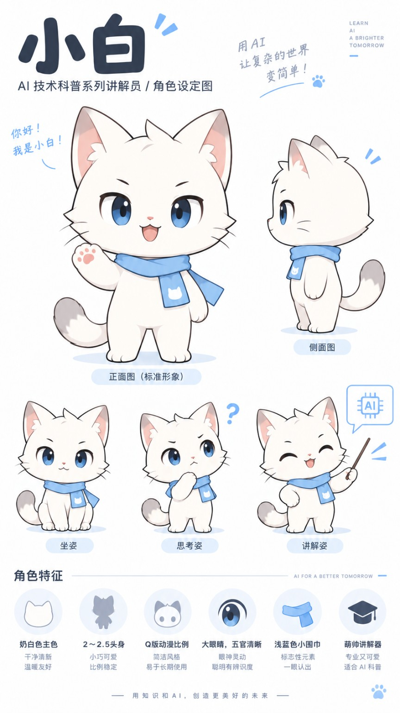

# CreatorOS IP Skills

把已经设计好的知识分镜，转成具有统一角色与视觉语言的生图Prompt。

```text
账号 → 多个栏目
         每个栏目组合：内容Skill ＋ IP Skill

主题 → 内容Skill → PageSpec × N → IP Skill → Prompt × N → 图像模型
```

[内容Skill](https://github.com/SlamWeb/knowledge-to-storyboard)负责研究、教学路径和每页内容；本仓库只负责角色、风格和视觉表达。两者可以独立替换，不重新设计上游教学。

## 小白

[读取Skill](xiaobai/SKILL.md) · [角色与动作参考图](xiaobai/assets/character.png)

奶白色小猫、蓝眼睛、浅蓝围巾；9:16竖版、暖白背景、浅蓝强调色。知识图是主角，小白是讲解员。



```text
creatorOS-ip-skills/
├── xiaobai/
│   ├── SKILL.md
│   └── assets/
│       └── character.png
├── README.md
└── SPEC.md
```

一张用户提供的原图同时包含角色与动作，不需要单独的expressions.png。小黑尚未提供设定，暂不创建空目录。

## 使用

> 读取xiaobai/SKILL.md与角色参考图，按这份PageSpec逐页输出最终生图Prompt。保持原页序和技术含义，不生成图片。

将每页Prompt与同一张角色图一起交给支持参考图的图像模型。写一个本地路径不等于图像模型实际收到图片；生产调用方需要附上资产。

本仓库只交付Prompt与资产，不含生图调用器。角色参考板上的口号、标签和装饰文字不应被复制进知识图片。

角色图由仓库所有者提供，原样收录；本仓库未声明额外的开源许可或第三方授权。当前完成Skill格式和资产完整性检查，尚未验证实际跨页生图一致性。
